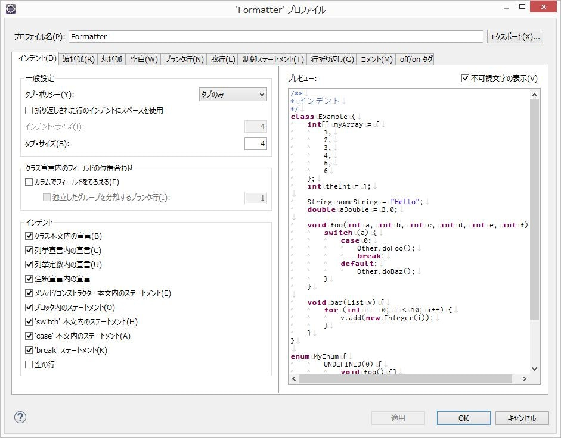

# Eclipse のフォーマッター設定

## どんなもの？

自分がテンプレートとして使っている、Eclipseのフォーマッター設定(Java用)です。

どのプロジェクトにもコーディング規約みたいなものは大体あるかと思います。

ただ残念なことに、仕様書として記載はあるけれど自動チェック的なものが無いということが少なからずあります。

そうなってくると、ほとんどの場合はコーディング規約は守られず、レビュー時に人力でチェックすることになりかなりツライ目にあうことになります。

そんなつらくくるしい時ために、このフォーマッター設定をコーディング規約に合わせて修正し、チームにばら撒いて使っていくためのものです。

## 使い方は？

1. Eclipseのプロジェクトからプロパティを開く
2. 「Java コード・スタイル」-「フォーマッター」を選択

3. 「インポート」ボタンを押して、フォーマッター設定のXMLファイルを読み込む

参考： 以下は、Java コード規約として最も有名な GoogleStyle の設定ファイル  
https://raw.githubusercontent.com/google/styleguide/gh-pages/eclipse-java-google-style.xml

4. インポートした XML ファイルをプルダウンから選択して、「編集ボタン」を押すと細かい設定ができる

5. あとはプロジェクトやjavaソースを右クリックして「ソース」-「フォーマット」を選択するときれいに整形される
